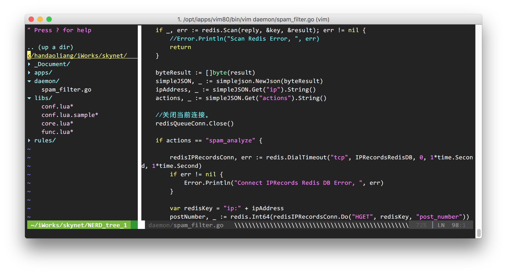

VIM Config Files Project
=======================



vim config files for VIM or MacVIM or GVIM

To use this:

`$ cd ~/`
`git clone https://github.com/VundleVim/Vundle.vim.git ~/.vim/bundle/Vundle.vim`
`$ git clone https://github.com/handaoliang/vim_conf.git ~/.vim`
`$ ln -s ~/.vim/_vimrc ~/.vimrc`


通过修改plugin/acp.vim 第138行，来决定提示匹配多少个字符。


" 通过修改这一项，以决定匹配多少个字符。默认是2，这里修改成3，以更符合编程习惯。
```
call s:defineOption('g:acp_behaviorKeywordLength', 3)
```

----------

" 关于编辑HTML文件时出现以下错误的修正：
```
Error detected while processing function htmlcomplete#CompleteTags:
line  304:
E121: Undefined variable: classlines
Press ENTER or type command to continue
```

编辑$VIMRUNTIME/autoload/htmlcomplete.vim，（一般是在vim的安装目录下，例如：/usr/share/vim/vim73/autoload/autoload/htmlcomplete.vim，~/.vim目录下一般为用户自定义的配置）
```
308        endif
309    " We gathered classes definitions from all external files
310    let classes += classlines
```
将309、310行移到 308 行的 endif 前面就好了：
```
308        " We gathered classes definitions from all external files
309        let classes += classlines
310    endif
```

------------

关于Golang工具包的安装：
```
GoInstallBinaries
```'

用到的开源项目：
`https://github.com/StanAngeloff/php.vim`
`https://github.com/disassembler/vim`
